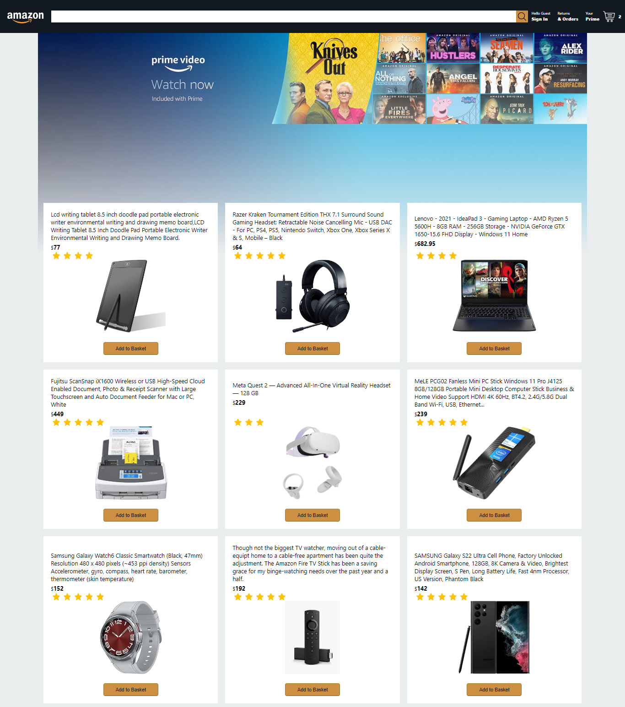

# full stack amazon clone live preview :

https://steadfast-twist.surge.sh/

# used tools and technologies:

- html  
- css 
- javascript 
- mediaQuery 
- react.js(routing,optimization and more..) 
- react hooks 
- context api (state management) 
- firebase(authentication) 
- firebase(database) 
- stripe(payment simulation) 

# project features

- Home page  
- Checkout page  
- Payment page  
- Orders page  
- login page  
- shooping cart and checkout 
- user authentication 
- payment processing 
